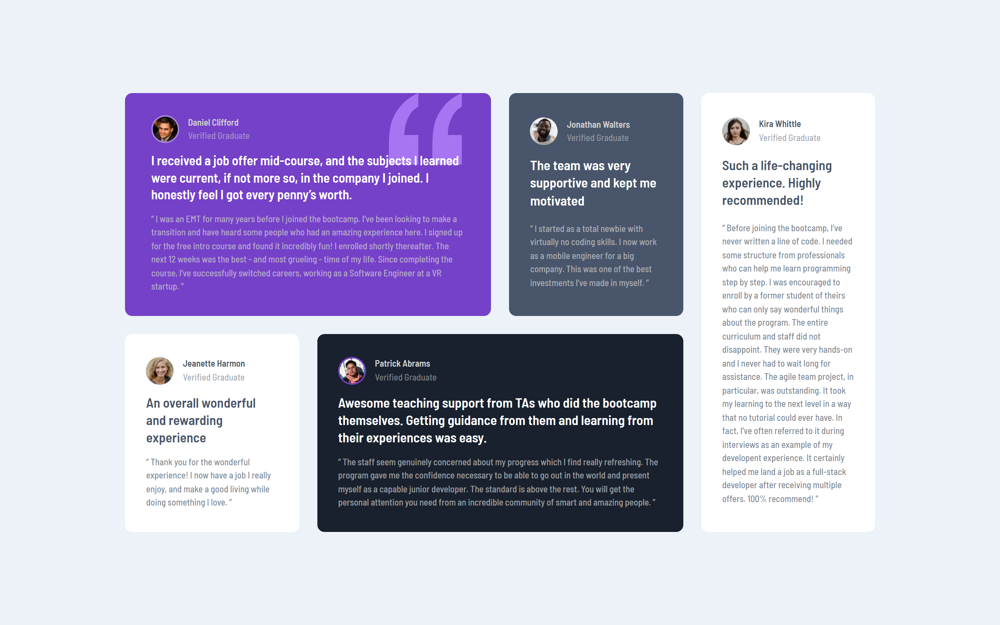

# Frontend Mentor - Testimonials grid section solution

This is a solution to the [Testimonials grid section challenge on Frontend Mentor](https://www.frontendmentor.io/challenges/testimonials-grid-section-Nnw6J7Un7). Frontend Mentor challenges help you improve your coding skills by building realistic projects. 

## Table of contents

- [Overview](#overview)
  - [The challenge](#the-challenge)
  - [Screenshot](#screenshot)
  - [Links](#links)
- [My process](#my-process)
  - [Built with](#built-with)
  - [What I learned](#what-i-learned)
- [Author](#author)

## Overview

This is the fourth challenge in the **Building Responsive Layouts Frontend Mentor Roadmap**.

It's a challenge that focus mainly on the powerful nature of CSS Grid.

### The challenge

Users should be able to:

- View the optimal layout for the site depending on their device's screen size

### Screenshot

#### Mobile

#### Desktop

### Links

- Solution URL: [Solution URL](https://www.frontendmentor.io/solutions/responsive-testimonials-grid-section-2LDg-Mq-EN)
- Live Site URL: [Live Site URL](https://frontendmentor-ilyesab.github.io/testimonials-grid-section/)

## My process

### Built with

- Semantic HTML5 markup
- CSS custom properties
- Flexbox
- CSS Grid
- Mobile-first workflow

### What I learned

How to leverage the powerful capabilities of **CSS Grid**. to make and change layouts easily based on the user's viewport size.

## Author

- Frontend Mentor - [@ilyesab](https://www.frontendmentor.io/profile/ilyesab)

